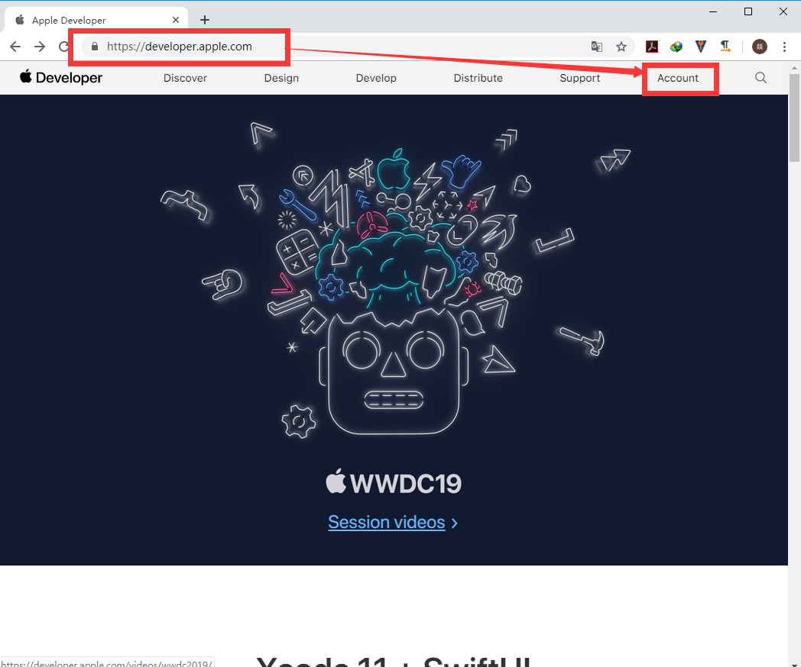
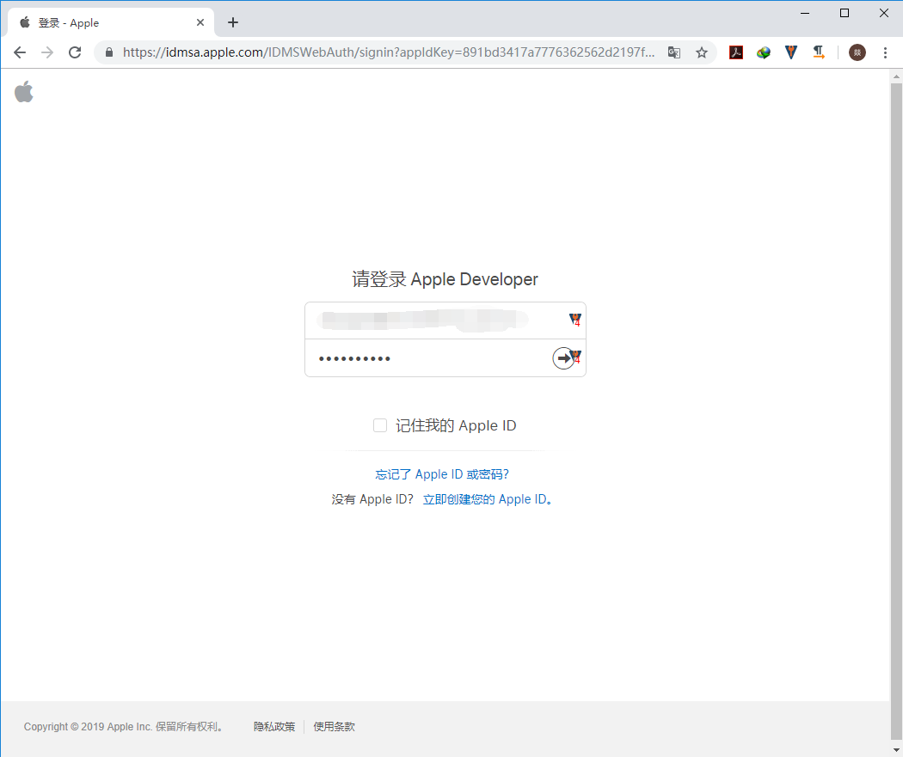
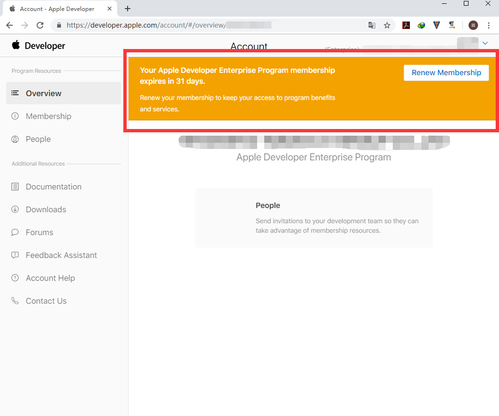

# 苹果企业开发账号续费操作说明

## 注意事项

苹果企业开发账号的续费需要当前时间距到期时间在一个月以内，才可以执行续费操作，如果当前时间距到期时间超过一个月则无法操作。

## 登录开发者网站

浏览器访问：https://developer.apple.com/

点击“**Account**”菜单，如下图：

在登录框中输入对应的账号密码：

## 查看续费提醒

登录后，如果满足注意事项中说的一个月以内的要求，会自动在上方弹出续费提醒，如下图：

## 执行续费操作

点击“**Renew Menbership**”，之后按提示一步步操作，即可完成账号续费。

当前企业开发者账号续费价格应该为`1988 RMB`